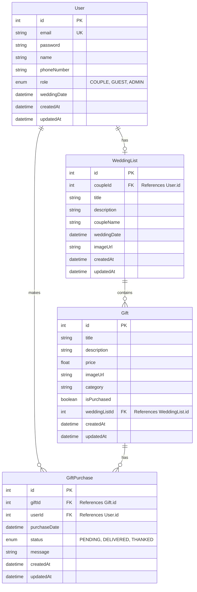

# MesaLista Database Relationship Diagram

## Relationship Explanations

1. **User to WeddingList**: One-to-one relationship
   - A user with role "COUPLE" can have one wedding list
   - A wedding list belongs to exactly one couple (user)

2. **WeddingList to Gift**: One-to-many relationship
   - A wedding list can have many gifts
   - Each gift belongs to exactly one wedding list

3. **User to GiftPurchase**: One-to-many relationship
   - A user can make multiple gift purchases
   - Each gift purchase is made by exactly one user

4. **Gift to GiftPurchase**: One-to-many relationship
   - A gift can have multiple purchases (though typically just one)
   - Each gift purchase is for exactly one gift

## Key Business Rules

- Users can have one of three roles: COUPLE, GUEST, or ADMIN
- Only users with the COUPLE role can create wedding lists
- Gifts belong to a specific wedding list and track whether they've been purchased
- Gift purchases track the status of a gift (PENDING, DELIVERED, THANKED)
- The database uses cascading deletes to maintain referential integrity
